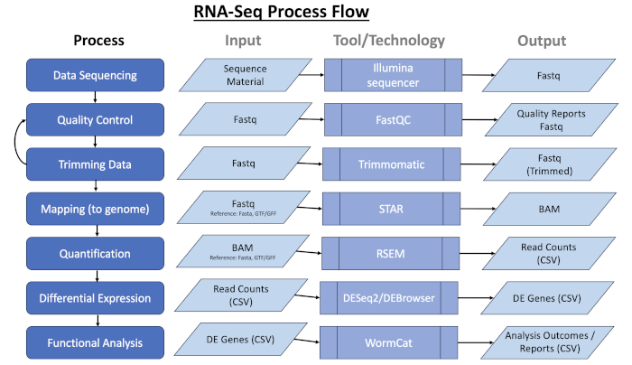

# RNA-Seq Pipeline Overview
    
### 
{title}

* __Prepared for__: 

{prepared_for}

* __Prepared by__ : {prepared_by}

* __Process Executed on__ : {process_date}

 

--- 
### Data Access
* __Dropbox Folder__: {dropbox_folder}
* __Dropbox URL__: [{dropbox_link}]({dropbox_link})

 

#### FASTQ files

<pre class="source-code">

{fastq_files}

</pre>

 

#### Gene Index files

Gene Index based on Wormbase Version: _{wormbase_version}_

--- 

### RNA Seq Process

### Pipeline Outputs

* MD5 Checksum Report
* FAST QC Report
* Multi QC Report
* Isoform Quantification
* Gene Quantification
* DESeq2 Gene Normalizations (Up, Down, All Expressed) & Visualizations
* WormCat Annotations and Visualizations of gene set enrichment data

### Source Code

The provided tagged repository is available to create reproducible outputs from the RNA-Seq Pipeline.

<table>
<tr><td><b>Config</b></td><td><a href="{pipeline_config}">{pipeline_config}</a></td></tr>
<tr><td><b>Pipeline</b></td><td><a href="{github_release}">{github_release}</a> -r {github_tag}</td></tr>
</table>

